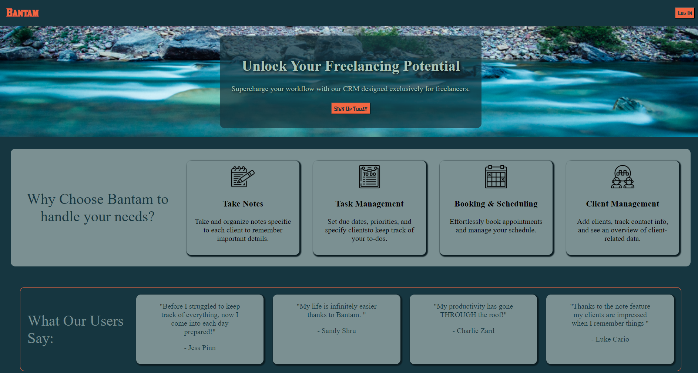
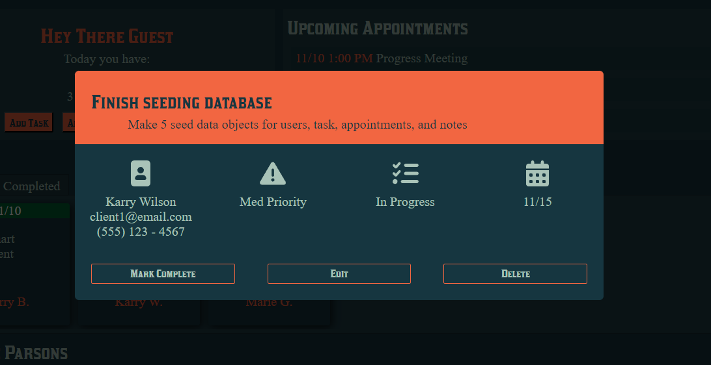
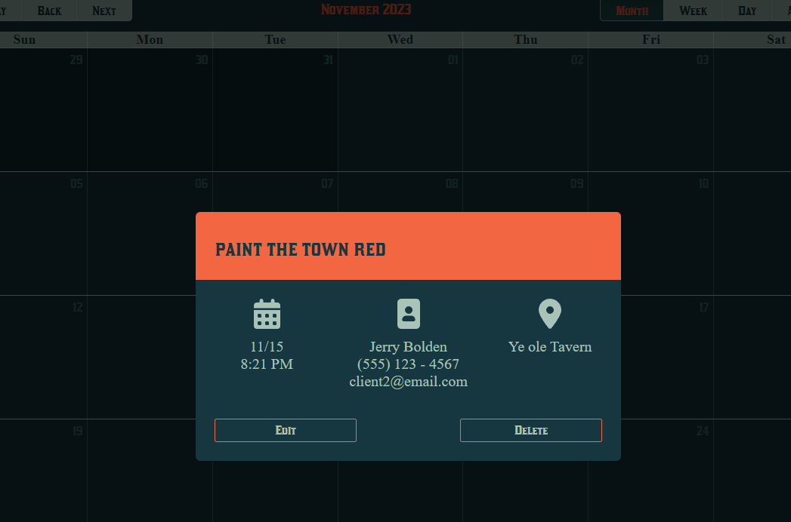
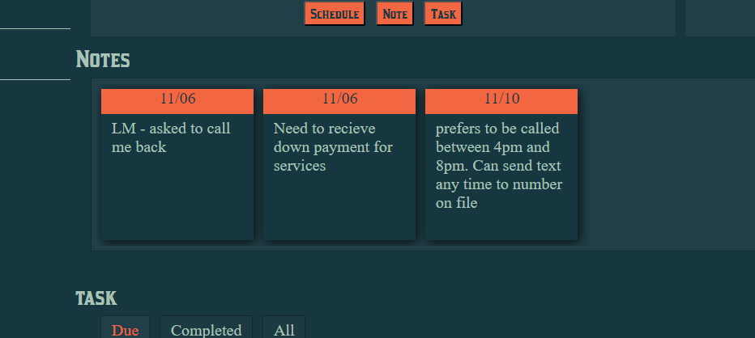
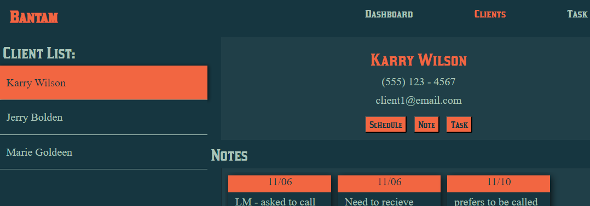
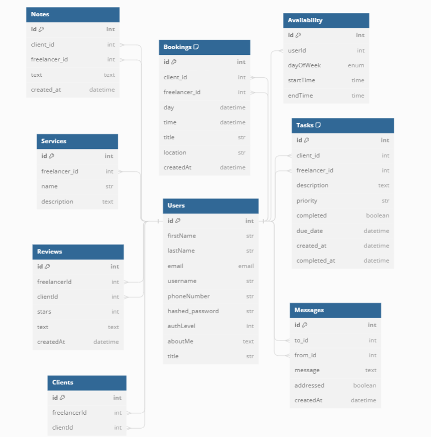
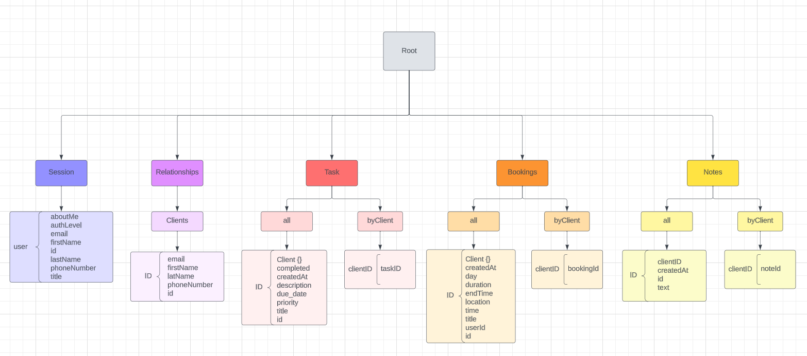

# Bantam CRM

Click here for the live site:  https://bantam-crm.onrender.com/

Bantam is a client management system designed for freelancers or other single party small business operations. The backend was built using Python and Flask and the frontend was built using Javascript and React.

## Table Of Contents

- [Features](#features)
    - [Task](#task)
    - [Bookings](#bookings)
    - [Notes](#notes)
    - [Relationships](#relationships-clients)
- [DB Schema](#sqlitepostgress-schema)
- [Redux Store](#redux-store)

## Features

### Task

Task are to do items that a user wants to remember to get done by a specific date. They can be associated with a specific client account or they could be a general task (with no associated account)  
*Table Columns*:  `id`, `freelancerId`, `clientId`, `description`, `title`, `priority`, `completed`, `due_date`, `createdAt`
 
*CRUD*: Users are able to Create, Read, Update and Delete task. They also can mark a task complete/ in progress.

### Bookings

Bookings are scheduled appointments a user has with a client. There are booking specific restrictions when creating, such as the user nor the client can have something scheduled during the chosen time frame or a client can only schedule within a freelancers avaliability window. The end time is not inputed by the user, it will be automatically calulated based on start time and duration and will be used to determine if a user is avaliable during a time slot and to display the appointments in the calender  
*Table Columns*:  `id`, `freelancerId`, `clientId`, `day`, `time`, `duration`, `endTime`, `title`, `location`, `createdAt`
 
*CRUD*: Users are able to Create, Read, Update and Delete task. They also can mark a task complete/ in progress.

### Notes

Notes allow a freelancer to keep track of specific details about a client. This is used to remember things like preferences (times to call, preferred name/pronoun, when the last contact was, what was spoken about when, ect ect). They are specific to a client account and freelancer.
 
*Table Columns*:  `id`, `freelancerId`, `clientId`, `text`, `createdAt`
 
*CRUD*: Users are able to Create, Read, Update and Delete notes.

### Relationships/ Clients

Clients are also a subclass of user. When a Freelancer connects to a client account it sets up a relationship between the two and adds the clients information (from thier user profile). The freelancer is then allowed to add that client on too other features. (For example booking an appointment for both the signed in freelancer and the client in question as long as both are not prebooked)
 
*Table Columns*:  `id`, `freelancerId`, `clientId`
 
*CRUD*: freelancers can GET relationships and POST relationships

## SQLite/POSTgress Schema

## Redux Store

<!-- React Components list (if you used React)
Database Schema (if you used a database)
frontend routes document
API routes document (if you have a backend API)
Redux store tree document (if you used Redux) -->
